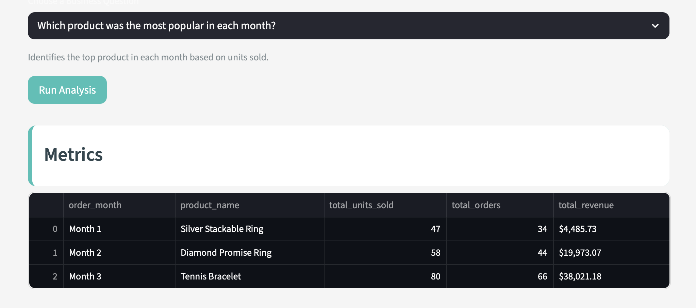
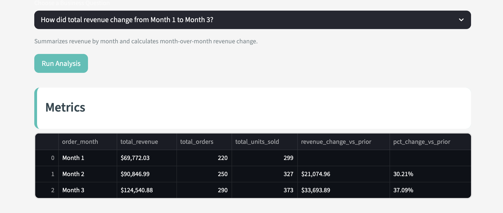
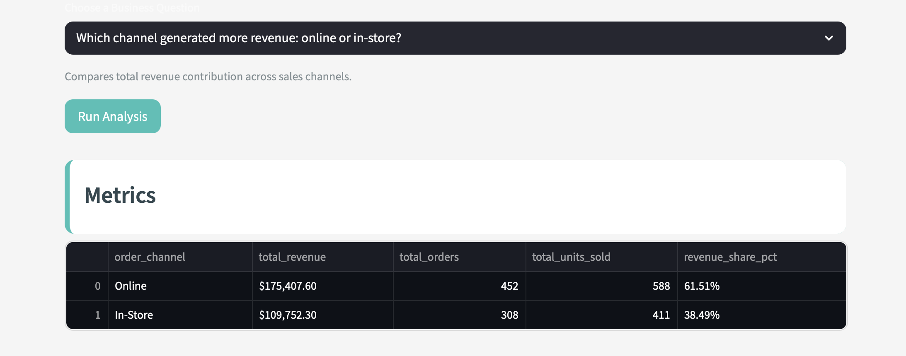

## Evaluation

To keep the evaluation simple but meaningful, I tested **InsightSprint** on the three supported descriptive business questions built into the app:

1. Which product was the most popular in each month?  
2. How did total revenue change from Month 1 to Month 3?  
3. Which channel generated more revenue: online or in-store?  

The evaluation used the synthetic jewelry retail transaction dataset included in the project. \

For each example, I compared the full **InsightSprint** workflow against a simpler baseline.

### Baseline
The baseline was a prompt-only workflow. In that version, the model received the business question & a simplified summary of the dataset, but it did not use the structured Python metric-calculation workflow built into **InsightSprint**.

### What Counted as Good Output
A strong output was defined as one that:
- Matched the computed metrics faithfully.
- Included all five required sections.
- Was clear & easy to review.
- Remained consistent in formatting across outputs.
- Stayed within descriptive boundaries & avoided unsupported causal or predictive claims.

## Example 1: Most Popular Product by Month
The screenshot below shows the InsightSprint output for the “most popular product by month” test case.

## Example 2: Revenue Change from Month 1 to Month 3
The screenshot below shows the InsightSprint output for the revenue change test case.

## Example 3: Online vs. In-Store Revenue
The screenshot below shows the InsightSprint output for the channel comparison test case.

### What the Comparison Showed
Compared with the prompt-only baseline, the full **InsightSprint** workflow produced more grounded & consistent results. Because the app computes the descriptive metrics in Python before generating the written brief, the outputs were more faithful to the data & easier to review. The structured workflow also made the *Supporting Metrics* section more reliable & reduced the risk of unsupported claims.

### Where the Project Broke Down
The project still has limitations. 
- Output formatting sometimes needed prompt refinement to remain visually consistent across question types. 
- The system also depends on a clean, structured dataset with the required columns. 
- Most importantly, the app is limited to descriptive analytics only & should not be used for causal interpretation, predictive analysis, or higher-stakes decision-making without additional methods & **human review**.